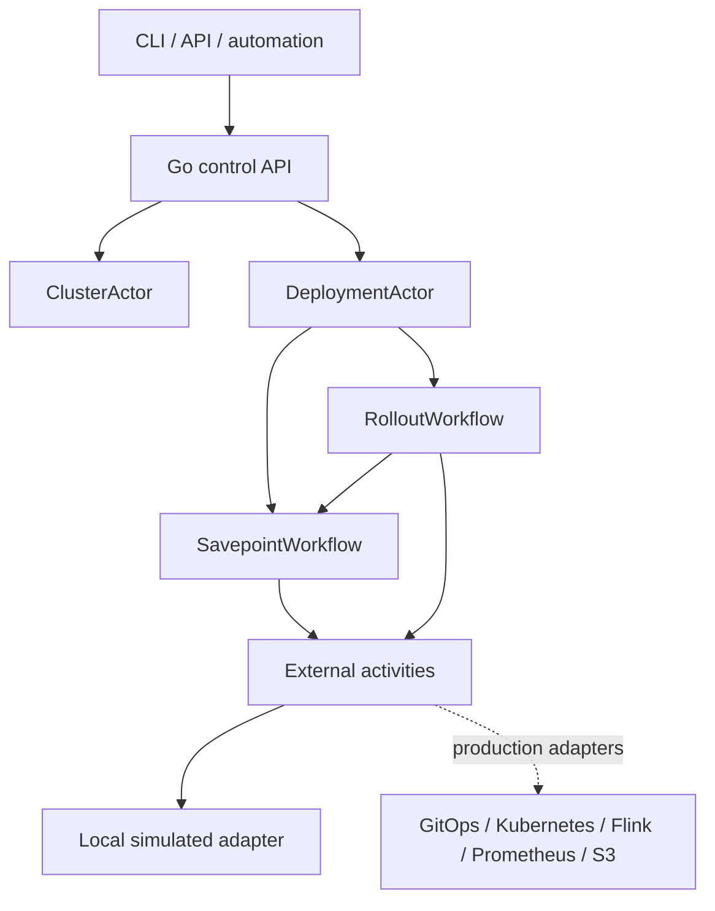

# FCP (Flink Control Plane)


FCP is an Apache-2.0-licensed Go library and reference control plane for operating stateful Apache Flink deployments with Temporal. It is designed for community adoption, commercial distributions, and enterprise-specific integrations without forking the deterministic workflow core.

Temporal owns durable control-plane workflows; the Flink Kubernetes Operator remains the runtime reconciler; Flink remains responsible for data-plane execution and state.

> Apache Flink and Flink are trademarks of The Apache Software Foundation. FCP is independent and is not affiliated with or endorsed by The Apache Software Foundation.

## Project status

FCP is pre-v1. Public Go APIs and Temporal contracts may change between minor releases until `v1.0.0`; changes will be documented. Do not deploy the reference HTTP server directly to production without authentication, authorization, TLS, and deployment-specific policy controls.

The repository is runnable locally without Kubernetes. External systems are represented by deterministic workflow contracts and a simulated activity adapter. A real Kubernetes adapter that drives the Flink Kubernetes Operator ships in [`backends/kubernetes`](backends/kubernetes/) — the same workflow APIs operate either backend.

- **Run against real Flink locally:** [`deploy/local`](deploy/local/) brings up kind + Flink Operator 1.15 + Flink 2.2 + Kafka (fed by the public Wikimedia EventStreams) and drives every workflow transition end-to-end ([`examples/demo/run.sh`](examples/demo/run.sh)).
- **Onboard a third party on EKS:** [`deploy/helm/fcp`](deploy/helm/fcp/) installs FCP against their own operator and Flink jobs, with their own Temporal (or a bundled one for trials).
- **Operate ~10,000 jobs:** see [`docs/SCALING.md`](docs/SCALING.md) and the [`cmd/loadgen`](cmd/loadgen/) harness.

## Use as a library

```bash
go get github.com/flink-control-plane/fcp
```

Implement the public backend contract:

```go
type Backend struct {
    // Kubernetes, Git, Flink, Prometheus, S3, and audit clients.
}

var _ activities.Backend = (*Backend)(nil)
```

Register it with Temporal workers:

```go
activityWorker := worker.New(temporalClient, "fcp-activities", worker.Options{})
fcp.RegisterActivities(activityWorker, backend)

workflowWorker := worker.New(temporalClient, "fcp-workflows", worker.Options{})
fcp.RegisterWorkflows(workflowWorker)
```

The module path assumes the project will be hosted at `github.com/flink-control-plane/fcp`. Change it before the first tagged release if a different organization owns the canonical repository.

## Implemented

- Stable `ClusterActor` and `DeploymentActor` workflow IDs.
- Serialized deployment commands delivered as Temporal signals.
- Deployment status, version history, operation history, and savepoint queries.
- Idempotency-key deduplication.
- Continue-as-new with compacted actor state.
- Rollout and savepoint child workflows.
- Conservative change classification and state-compatibility policy.
- Prod approvals, cluster freeze enforcement, capacity leases, health gates, and rollback.
- Suspend, resume, savepoint, deploy, rollback, scale, autoscaler enable/freeze, and manual continue-as-new APIs.
- Separate Temporal task queues for actor workflows and external activities.
- Simulated GitOps/Kubernetes/Flink/S3/metrics behavior for local end-to-end execution.
- Temporal workflow tests and HTTP API contract tests.

The current capacity lease is implemented as an idempotent activity-backed reservation store. A durable `DeploymentResourceActor` can replace it when reservations need to survive worker process loss independently of rollout history. The autoscaler implementation is governance-only; the Flink Operator remains the scaling decision maker.

## Architecture



Actor workflow IDs:

- `flink-cluster/<env>/<namespace>`
- `flink-deployment/<env>/<namespace>/<name>`
- `flink-rollout/<env>/<namespace>/<name>/<operationId>`
- `flink-savepoint/<env>/<namespace>/<name>/<operationId>`

## Run locally

Requirements: Go 1.24+, Docker, and Docker Compose.

Start Temporal, PostgreSQL, the worker, and the API:

```bash
docker compose --profile app up --build
```

Endpoints:

- FCP operations console: `http://localhost:8080`
- Control API: `http://localhost:8080/api/v1`
- Temporal UI: `http://localhost:8088`

List active deployment actors:

```bash
curl 'http://localhost:8080/api/v1/deployments?environment=integration&namespace=streaming&limit=100'
```

Alternatively, start only Temporal and run the Go processes directly:

```bash
docker compose up -d postgresql temporal temporal-ui
go run ./cmd/worker
go run ./cmd/control-api
```

## Example flow

Register the deployment actor:

```bash
curl -X PUT http://localhost:8080/api/v1/deployments/integration/streaming/orders \
  -H 'Content-Type: application/json' \
  -d '{"owner":"streaming","serviceAccount":"flink-orders","nodePool":"arm64","flinkDashboardUrl":"http://localhost:8081"}'
```

Deploy a digest-pinned version:

```bash
curl -X POST http://localhost:8080/api/v1/deployments/integration/streaming/orders/deploy \
  -H 'Content-Type: application/json' \
  -H 'Idempotency-Key: deploy-orders-001' \
  -d '{
    "requester":"on-call",
    "approved":true,
    "spec":{
      "imageDigest":"registry.example/orders@sha256:abc123",
      "flinkVersion":"2.2",
      "jobArgs":{"source.topic":"orders"},
      "flinkConfig":{"state.backend.type":"rocksdb"},
      "parallelism":8,
      "maxParallelism":128,
      "resources":{
        "taskManagerCpu":2,
        "taskManagerMemoryMiB":4096,
        "taskManagerCount":2,
        "slotsPerManager":4
      },
      "stateCompatibility":{
        "jobGraphCompatible":true,
        "operatorUidsStable":true
      }
    }
  }'
```

Inspect durable actor state:

```bash
curl http://localhost:8080/api/v1/deployments/integration/streaming/orders/actor
```

Trigger a savepoint:

```bash
curl -X POST http://localhost:8080/api/v1/deployments/integration/streaming/orders/savepoint \
  -H 'Content-Type: application/json' \
  -H 'Idempotency-Key: savepoint-orders-001' \
  -d '{"requester":"on-call"}'
```

Freeze namespace-level mutations:

```bash
curl -X POST http://localhost:8080/api/v1/clusters/integration/streaming/freeze \
  -H 'Content-Type: application/json' \
  -d '{"requester":"incident-commander","reason":"active incident"}'
```

## Safety behavior

- Every deployment command requires `Idempotency-Key`.
- Prod operations classified as risky require approval.
- Max-parallelism decreases are rejected after state exists unless a fresh start is explicitly approved.
- Job argument, operator UID, job graph, and non-restored-state changes are treated conservatively.
- Stateful changes create a savepoint before apply.
- Resource-increasing changes acquire a time-bound lease.
- A rollout succeeds only after runtime, checkpoint, restart, backpressure, Kafka lag, and sink gates pass.
- Failed health gates restore the previous healthy version.
- Savepoints remain allowed while a cluster is frozen; runtime mutations do not.

For local failure testing, use an image digest containing `deadbeef`; the simulated metrics adapter will fail health gates and exercise rollback.

## Configuration

| Variable | Default | Purpose |
|---|---|---|
| `TEMPORAL_ADDRESS` | `localhost:7233` | Temporal frontend |
| `TEMPORAL_NAMESPACE` | `default` | Temporal namespace |
| `ACTOR_TASK_QUEUE` | `flink-control-actors` | Actor and child workflows |
| `ACTIVITY_TASK_QUEUE` | `flink-control-activities` | External I/O activities |
| `HTTP_ADDRESS` | `:8080` | API listen address |
| `SIMULATION_DELAY` | `100ms` | Simulated external call latency |
| `CONTINUE_AS_NEW_AFTER` | `500` | Commands before actor compaction |

## Development

```bash
make verify
```

Public compatibility policy is documented in [docs/api-compatibility.md](docs/api-compatibility.md). Contributions follow [CONTRIBUTING.md](CONTRIBUTING.md), project decisions follow [GOVERNANCE.md](GOVERNANCE.md), and vulnerabilities should be reported according to [SECURITY.md](SECURITY.md).

The `activities.Backend` interface is the production integration boundary. Community adapters may live in this repository or separate modules. Enterprise adapters may remain proprietary while consuming the same public core.
